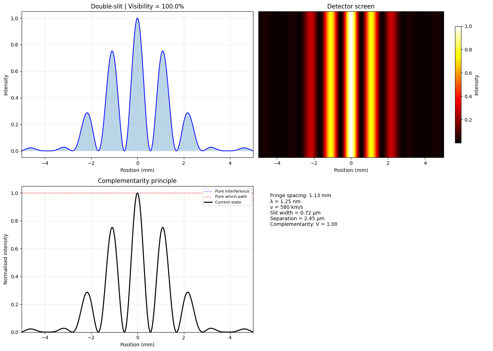

# Quantum-DoubleSlit-Complementarity-Simulator
Interactive simulation of Young's double-slit experiment with gradual transition from interference to particle behavior via path measurement strength.
# مـحـاكـاة تـجـربـة الـشـق الـمـزدوج الـكـمـي – نـمـوذج بـالـرمـضان V9.3

[](https://creativecommons.org/licenses/by/4.0/)
[](https://www.python.org/downloads/)
[](https://jupyter.org/)

محاكاة تفاعلية لتجربة الشق المزدوج الكمي، توضح مبدأ التكاملية (Complementarity) والانتقال التدريجي من نمط التداخل إلى السلوك الجسيمي بتأثير المراقبة (قياس المسار).

---

## 🌟 الميزات الرئيسية

- **نمط التداخل الدقيق** مع حسابات الطول الموجي لدي برولي، تداخل الشق المزدوج، وحيود الشق الواحد.
- **التحكم بالسرعة وتوزع السرعات** (محاكاة تأثير درجة الحرارة الحركية).
- **فقدان التماسك التدريجي** عبر شدة القياس (Measurement strength) لمحاكاة مبدأ بور للتكاملية.
- **نمط جسيمي صحيح** (قمتان غاوسيتان خلف الشقين) عند معرفة المسار بشكل كامل.
- **عرض بياني متكامل**:
  - نمط التداخل الحالي مع قيمة الرؤية (Visibility).
  - شاشة الكاشف المحاكاة.
  - مقارنة بين الأنماط الثلاثة (تداخل خالص، جسيمي خالص، والحالي).
  - لوحة معلومات فيزيائية (تباعد الأهداب، الطول الموجي، السرعة، أبعاد الشقوق، وقيمة التكاملية).
- **تأثيرات إضافية اختيارية**: ضجيج الكاشف الحراري، التراكم الزمني بعدد محدد من الجسيمات.

---

## 📦 المتطلبات

- Python 3.8 أو أحدث
- المكتبات المطلوبة (موجودة في `requirements.txt`):

```bash
numpy>=1.21.0
matplotlib>=3.4.0
ipywidgets>=7.7.0
scipy>=1.7.0
tqdm>=4.62.0
